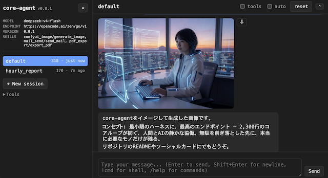

# core-agent

[antirez/ds4](https://github.com/antirez/ds4) の `ds4_agent`(ネイティブ推論エンジンに
in-process直結したCLIコーディングエージェント)を、任意のOpenAI/Anthropic互換HTTPエンドポイントを
差し替え可能な形で作り直した上で機能拡張したNode/TypeScript版のハーネスです。

**TUI(ターミナルREPL)版とGUI(ブラウザ)版**の2つの入口があり、ツール・セッション管理・
LLM接続などのバックエンドは完全に共有しています。

## 特徴

- **バックエンド差し替え可能**: `.env`の`OPENAI_BASE_URL`/`LLM_MODEL`を変えるだけで、ローカルの
  推論サーバー(`ds4-server`等)からクラウドAPIまで任意のOpenAI互換エンドポイントに切り替え可能。
  `LLM_PROTOCOL=anthropic`でAnthropicの`/v1/messages`形式にも対応。
- **検索エンジンも差し替え可能**: 既定はブラウザ経由のGoogle検索だが、`SEARCH_ENGINE_URL`に
  セルフホストの検索エンジン(SearXNG等、`?q=...&format=json`でJSONを返すもの)を指定すると、
  Chromeを一切使わずAPI直接呼び出しに切り替わる。
- **TUI/GUI両対応**: 同じバックエンドに、ターミナルREPL(`cli.ts`)とブラウザUI
  (`webServer.ts`)の2つの入口からアクセスできる。GUI版はネイティブIME対応・Markdownテーブル・
  画像/動画/音声のインライン表示など、TUIには無い機能もある。
- **Vision自動ルーティング**: メインモデルがVision非対応でも、`view_image`という合成tool call経由で
  別のVision対応モデルに自動フォールバックする。
- **ツール一式**: `read`/`more`/`write`/`list`/`edit`/`search`/`bash`/`bash_status`/`bash_stop`/
  `google_search`/`visit_page`(Puppeteerでブラウザ操作)/`show_media`(画像・動画・音声を
  人間に見せる)。
- **破壊的操作への確認ゲート**: `write`/`edit`/`bash`は既定で実行前にy/N確認(スキップ可能)。
- **長時間セッション対応**: context圧縮(古い履歴の自動要約)、セッションの保存/再開。
- **プロジェクト指示ファイルの自動読込**: ユーザーがプロジェクト固有のルール・背景をモデルに
  常に伝えたい時は、cwdに`AGENT.md`(または`AGENTS.md`/`.agent.md`)を書いておくと起動時に
  自動で読み込まれsystem promptに反映される(Claude CodeのCLAUDE.md相当)。
- **Hooks**: tool実行の前後に外部コマンドを差し込める(`.core-agent/hooks.json`)。
- **skill機構**: メール送信・天気取得・画像生成のようなドメイン固有機能はcoreに入れず、
  `skills/<name>/skill.json`でツールとして動的登録する(Python等、任意の言語で実装可能)。
- **cron(内蔵スケジューラー)**: TUI・GUIどちらを起動していても、`.core-agent/cron.json`の
  設定に従って決まった時刻にskillを使ったタスクを自動実行する。**cronを使う場合はTUI/GUI
  どちらか一方だけを起動しっぱなしにしてください**(両方同時に動かすと同じジョブが二重に
  実行されます。詳細は `docs/tui.md` / `docs/gui.md` の該当セクション参照)。

## すぐ使う

Node.jsのインストール不要、単一実行ファイルをダウンロードするだけで使えます。

- [**GitHub Releases**](../../releases) から、お使いのOS向けのTUI版(`core-agent`)または
  GUI版(`core-agent-gui`)をダウンロードしてください。
- ダウンロード後の使い方(セットアップ・`.env`設定・実行方法)は同梱の`README.md`
  (リポジトリ内では [`dist-bin/README.md`](./dist-bin/README.md) と同じ内容)を参照してください。

**注意**: core機能(read/write/edit/search/bash/visit_page/google_search/view_image/
show_media)は実行ファイル単体で動きますが、`mail_send`/`pdf_export`等の**skillツールを
使う場合はNode.jsが別途必要**です。また、**Python**はskillとは無関係に、LLMがグラフ作成・
データ分析等で自発的にコードを書いて実行しようとする一般的な用途で事実上必須です
(初回起動時に専用venvが自動作成され、パスは`.env`の`PYTHON_PATH`に自動設定されますが、
Python本体のインストールは別途必要)。

## ソースからビルド・開発したい場合

- 📟 **[TUI版のセットアップ・使い方 → `docs/tui.md`](./docs/tui.md)**
- 🌐 **[GUI版のセットアップ・使い方 → `docs/gui.md`](./docs/gui.md)**
- 📦 **[バイナリのビルド方法 → `docs/binary-build.md`](./docs/binary-build.md)**

いずれも単独で読めば動かせるように書かれています。

## 開発元ネタとの関係

このプロジェクトの元ネタである [antirez/ds4](https://github.com/antirez/ds4) には一切書き込みを
行っていません(参照専用)。`ds4.c`(推論エンジン本体)はDeepSeek V4 Flash専用のネイティブ実装で
汎用化の対象外、`ds4_agent.c`(ハーネス)の設計を参考にしつつ、Node/TypeScriptでスクラッチ実装しています。
